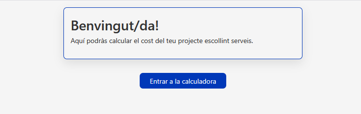
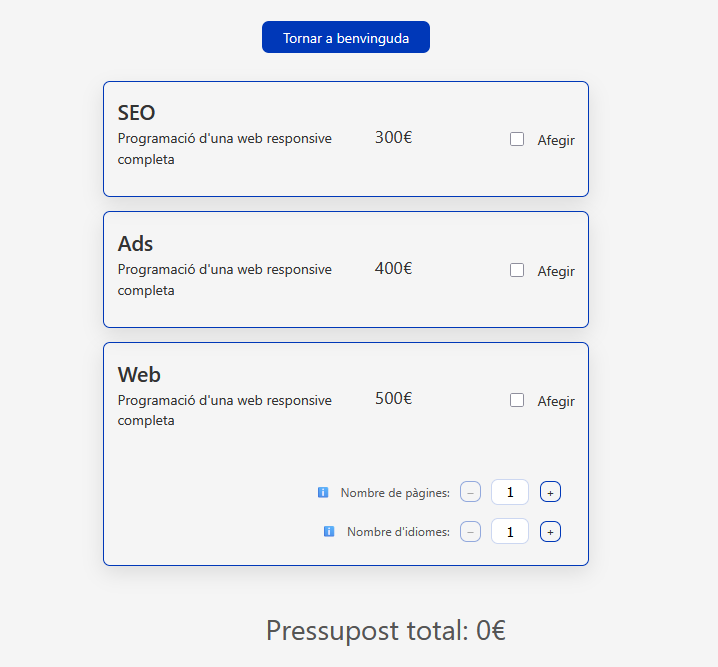
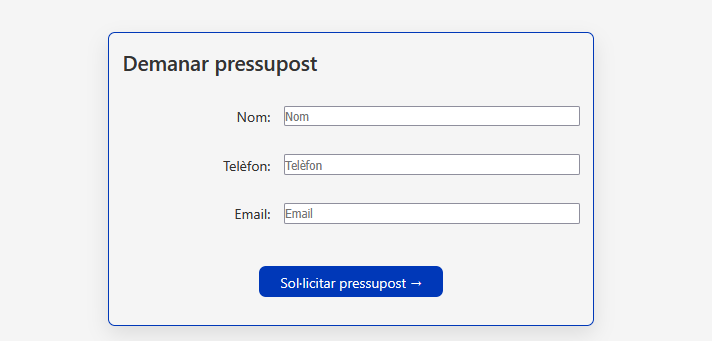
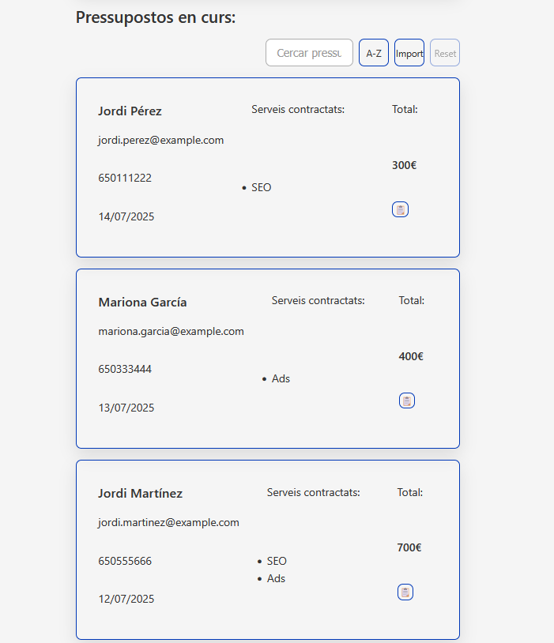
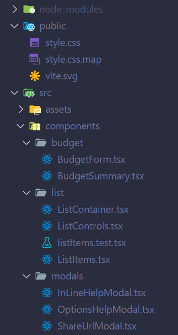
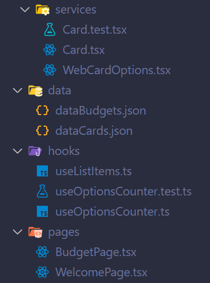
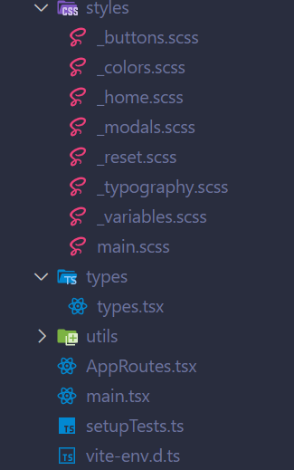
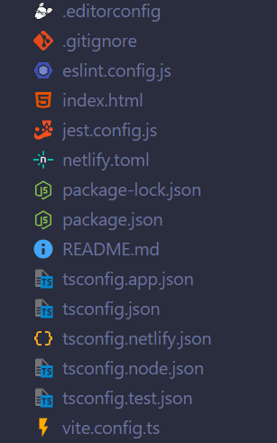

# 🎓 2025-S6 Pràctica Acadèmica / 2025-S6 Academic Practice

Albert Valls






## 📚 Índex / Table of Contents

1. [Sobre el projecte / About](#1-sobre-el-projecte--about)
2. [Funcionalitats / Features](#2-funcionalitats--features)
3. [Tecnologia / Tech Stack](#3-tecnologia--tech-stack)
4. [Demo en línia / Live Demo](#4-demo-en-línia--live-demo)
5. [Repositori / Repository](#5-repositori--repository)
6. [Estructura / Structure](#6-estructura--structure)
7. [Instal·lació / Installation](#7-instal·lació--installation)

## 1. Sobre el projecte / About

**CAT:**

Aquest projecte consisteix en una aplicació web interactiva, desenvolupada amb React i TypeScript sobre Vite, que facilita el càlcul i la gestió de pressupostos per a serveis de màrqueting i desenvolupament web. A la pantalla principal, l’usuari /ària tria entre tres opcions: campanya SEO (300 €), campanya de publicitat Ads (400 €) o pàgina web (500 €). Si selecciona la pàgina web, apareix un component addicional per ajustar el nombre de pàgines i d’idiomes, amb un cost extra de 30 € per unitat, calculat automàticament com (pàgines + idiomes) × 30 €.

Un cop configurades les opcions, l’usuari /ària pot omplir un formulari amb les dades del client/a (nom, telèfon i email) i afegir tants pressupostos com vulgui, cadascun amb el seu cost total i detall de serveis. La llista de pressupostos es mostra en cartes reutilitzables on es pot ordenar per data, import o alfabèticament, i filtrar mitjançant un cercador de noms. A més, cada pressupost disposa d’un botó per compartir-ne l’enllaç: la URL es construeix en temps real per reflectir exactament les opcions triades, i es presenta en un modal accessible que permet copiar-la fàcilment.

S’ha treballat amb una estructura modular de components, hooks personalitzats per al comptador d’opcions i lògica de construcció de query-strings, estils SCSS amb variables globals i BEM, i routing amb React Router per navegar entre la pantalla de benvinguda i la calculadora. Aquesta organització garanteix mantenibilitat, reutilització i escalabilitat del codi, així com una experiència d’usuari clara i accessible.

**EN:**

This project is an interactive web application built with React and TypeScript on top of Vite, designed to streamline the calculation and management of budgets for marketing and web‐development services. On the main screen, users can choose between three options: an SEO campaign (€300), an Ads campaign (€400), or a website (€500). If the website option is selected, an additional component appears allowing the user to specify the number of pages and languages, with an extra cost of €30 per unit, automatically calculated as (pages + languages) × €30.

After configuring their choices, users can fill out a form with client information (name, phone, email) and add as many budgets as they wish, each displaying its total cost and service breakdown. The budget list is presented in reusable cards that can be sorted by date, amount, or alphabetically, and filtered via a name search. Furthermore, each budget card includes a button to share its link: the URL is generated in real time to match the selected options and is displayed in an accessible modal for easy copying.

We implemented a modular component architecture, custom hooks for option counters and query-string generation, SCSS styling with global variables and BEM conventions, and React Router for navigation between the welcome screen and the calculator. This structure ensures code maintainability, reusability, and scalability, as well as a clear and accessible user experience.

## 2. Funcionalitats / Features

- ✅ **React**
- ✅ **TypeScript → JavaScript**
- ✅ **Vite**
- ✅ **SASS**
- ✅ **Testing**

## 3. Tecnologia / Tech Stack

- **React (18.2)**
- **Vite**
- **JavaScript (ES6+)**
- **TypeScript**
- **Jest**
- **SASS**
- **CSS**
- **Jest**
- **Git & GitHub**

## 4. Demo en línia / Live Demo

**Live:** 👉 https://budgets-albertvalls.netlify.app/

**CAT:**  
Visita la demo en línia per veure l’aplicació en funcionament.

**EN:**  
Check out the live demo to see the application in action.

## 5. Repositori / Repository

**Github:** 👉 https://github.com/albertvallsbe/2025-s6-albertvalls

## 6. Estructura / Structure

**CAT:**  
La següent imatge mostra l’estructura de carpetes principal del projecte:

**EN:**  
The following image illustrates the main folder structure of the project:






```
2025-s6-albertvalls/
├── node_modules/
├── public/
│   ├── style.css
│   ├── style.css.map
│   └── vite.svg
├── src/
│   ├── assets/
│   │   ├── images/
│   │   └── react.svg
│   ├── components/
│   │   ├── budget/
│   │   │   ├── BudgetForm.tsx
│   │   │   └── BudgetSummary.tsx
│   │   ├── list/
│   │   │   ├── ListContainer.tsx
│   │   │   ├── ListControls.tsx
│   │   │   ├── ListItems.tsx
│   │   │   └── listItems.test.tsx
│   │   ├── modals/
│   │   │   ├── InLineHelpModal.tsx
│   │   │   ├── OptionsHelpModal.tsx
│   │   │   └── ShareUrlModal.tsx
│   │   └── services/
│   │       ├── Card.tsx
│   │       ├── WebCardOptions.tsx
│   │       └── Card.test.tsx
│   │── data/
│   │   ├── dataBudgets.json
│   │   └── dataCards.json
│   │── hooks/
│   │   ├── useListItems.ts
│   │   ├── useOptionsCounter.ts
│   │   └── useOptionsCounter.test.ts
│   │── pages/
│   │   ├── BudgetPage.tsx
│   │   └── WelcomePage.tsx
│   │── styles/
│   │   ├── _buttons.scss
│   │   ├── _colors.scss
│   │   ├── _home.scss
│   │   ├── _modals.scss
│   │   ├── _reset.scss
│   │   ├── _typography.scss
│   │   ├── _variables.scss
│   │   └── main.scss
│   │── types/
│   │   └── types.tsx
│   │── utils/
│   │   └── urlUtils.ts
│   │── AppRoutes.tsx
│   │── main.tsx
│   │── setupTests.ts
│   └── vite-env.d.ts
├── .editorconfig
├── .gitignore
├── eslint.config.js
├── index.html
├── jest.config.js
├── package-lock.json
├── package.json
├── README.md
├── tsconfig.app.json
├── tsconfig.json
├── tsconfig.netlify.json
├── tsconfig.node.json
├── tsconfig.test.json
└── vite.config.ts
```

## 7. Instal·lació / Installation

**CAT:**

_Segueix aquests passos per clonar el projecte i fer servir el compilador TypeScript en mode “watch” i executa els estils amb SASS també en mode "watch"._

**EN:**

_Follow these steps to clone the project, use the TypeScript compiler in “watch” mode, and run the styles with SASS also in “watch” mode._

**Requeriments / Prerequisites**

- Node.js

### 1) Clonar el repositori / Clone the repository

```bash
git clone https://github.com/albertvallsbe/2025-s6-albertvalls.git
```

### 2) Entrar al directori del projecte / Navigate into the project directory

```
cd 2025-s6-albertvalls
```

### 3) Instal·lar dependències / Install dependencies

```
npm i
```

### 4) Executar el compilador de Vite per a desenvolupament / Run Vite compiler in developer mode

```
npm run dev
```

### 6) Obre el live Server de Vite / Open the Live Server of Vite

```
http://localhost:5173
```
